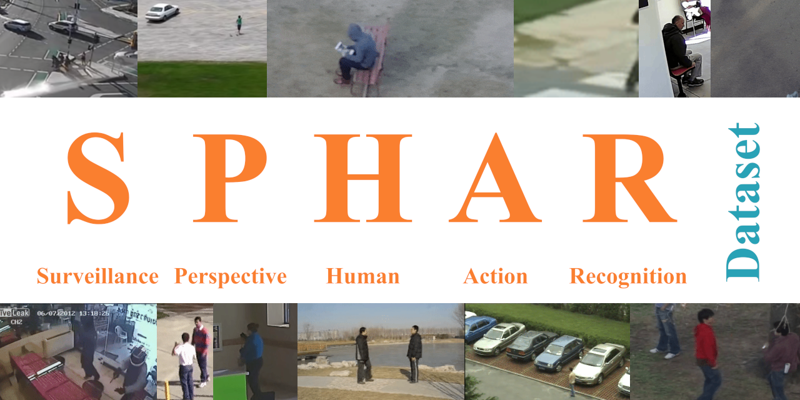
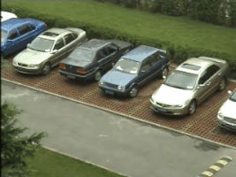
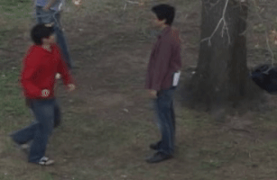
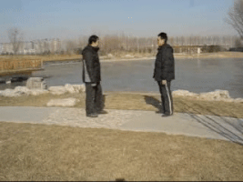
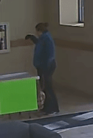
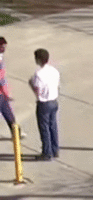
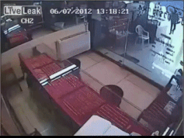
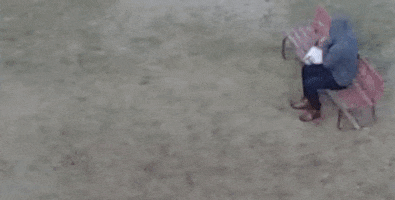
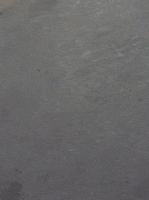
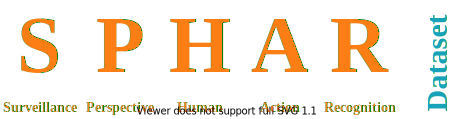

# **SPHAR**: **S**urveillance **P**erspective **H**uman **A**ction **R**ecognition Dataset


**SPHAR** is a video dataset for **human action recognition**. Its main purpose is to support research in the application area of analyzing activities on public places.

In this domain, most cameras will share a similar mounting angle and perspective, which we will call the **surveillance perspective** from now on. In **SPHAR**, all videos are shot from this or a similar perspective.

The videos have been aggregated from multiple sources, converted to a consistent file type (`H265 HEVC .mp4`), cutted and cropped (spatio-temporally) to contain only one action at a time and last but not least sorted into 14 action classes.

This Repository contains all videos of the SPHAR dataset as well as the [scripts](scripts) needed to create the dataset.

## Dataset Overview

| # Videos |# Classes | Videos per Class | Video Sources | Dataset Size | Year |
|----------|----------|------------------|---------------|--------------|------|
|     7759 |       14 |         0 - 2800 |            11 |       6.2 GB | 2020 |

Videos per class and source dataset:

|source|hitting|kicking|falling|vandalizing|panicking|sitting|walking|running|neutral|luggage|stealing|murdering|carcrash|igniting|license|
|-|-|-|-|-|-|-|-|-|-|-|-|-|-|-|-|
|[CAVIAR](http://groups.inf.ed.ac.uk/vision/CAVIAR/CAVIARDATA1/)|4|0|3|0|0|1|61|0|5|5|0|0|0|0|public|
|[CASIA](http://www.cbsr.ia.ac.cn/english/Action%20Databases%20EN.asp)|12|0|36|14|48|0|204|96|0|0|11|0|0|0|author's permission|
|[UCF-Aerial](https://www.crcv.ucf.edu/research/data-sets/ucf-aerial-action/)|0|0|0|0|0|0|71|8|64|0|0|0|0|0|research-only|
|[UCF-Crime](https://www.crcv.ucf.edu/projects/real-world/)|100|50|0|50|0|0|0|0|0|0|400|50|150|100|research-only|
|[UT-Interaction](https://cvrc.ece.utexas.edu/SDHA2010/Human_Interaction.html)|40|20|0|0|0|0|0|0|60|0|0|0|0|0|MIT|
|[BIT-Interaction](https://sites.google.com/site/alexkongy/software)|100|50|0|0|0|0|0|0|250|0|0|0|0|0|non-commercial|
|[Live Videos](https://cvrleyva.wordpress.com/2017/04/08/lv-dataset/)|1|0|1|1|4|0|0|0|1|0|7|2|7|1|CC-BY-NC|
|[UCF-ARG](https://www.crcv.ucf.edu/research/data-sets/ucf-arg/)|144|0|0|144|0|0|288|288|432|0|0|0|0|0|research-only|
|[VIRAT Ground](https://viratdata.org/)|0|0|0|0|0|208|1111|22|214|0|0|0|0|0|research & commercial|
|[MEVA](https://mevadata.org/)|0|0|0|0|0|22|0|0|0|3|1|0|0|0|CC-BY-4.0|
|[Okutama](http://okutama-action.org/)|0|0|83|0|0|390|1064|102|1170|0|0|0|0|0|CC-BY-NC-3.0|
|[**SPHAR**](https://github.com/AlexanderMelde/SPHAR-Dataset)|**401**|**120**|**123**|**209**|**52**|**621**|**2800**|**516**|**2166**|**8**|**418**|**52**|**157**|**101**|**multiple**|


## Example Videos
| falling | hitting | kicking | luggage | neutral | murdering | sitting | sitting | running |
|---------|---------|---------|---------|---------|-----------|---------|---------|---------|
|  |  |  |  |  |  |  |  | | 

## Known Caveats
Due to different and missing annotations in the original datasets, not all videos could be automatically cropped to the relevant area containing the action.

- The videos of the UCF-ARG and CASIA datasets are only cutted temporally. 
- The videos of the UCF-Crime, CAVIAR and Live Videos datasets are neither cropped nor cutted and might contain camera changes or watermarks. 
- Videos extracted from the MEVA, Okutama, Bit-Interaction, UCF-Aerial, VIRAT Ground and UT-Interaction datasets are both cropped and cutted to relevant actions, but the quality of the cut heavily depends on the quality of the original annotations and therefore varies by each dataset.

You can delete the videos you don't need using a simple filename search, as the video names contain abbreviations for each dataset.

## Download
The easiest way to just get the dataset videos is by downloading one of our [releases](https://github.com/AlexanderMelde/SPHAR-Dataset/releases):

- [**SPHAR-Dataset-1.0.zip**](https://github.com/AlexanderMelde/SPHAR-Dataset/archive/1.0.zip)

If you want to modify the dataset and use the conversion and cutting scripts, clone or fork this repository using:

```
git clone git@github.com:AlexanderMelde/SPHAR-Dataset.git
```

## License
Using the datasets for researching purposes is possible for all of the videos, but licensing is difficult when aggregating data from multiple sources and licenses.

All videos of this dataset contain a reference to the original dataset source in their filename. You must refer to the original licensing conditions for each video / dataset and filter out (remove) any videos you are not licensed to use (see table above).

The work of the **SPHAR Dataset** (aggregation, converting and cropping scripts) - but not the videos itself - are released under the **GNU GPL v3** license (contact me for further licensing options).

See the [LICENSE](LICENSE) file for more details.

## Citation
Please note that none of the supplied videos have been recorded by myself.
**Please attribute the original authors wherever possible.**

If you want to cite the work of the **SPHAR Dataset** (aggregation, converting and cropping), please link to this GitHub page. You can use the following BibTex entry:

```bib
@article{sphar-dataset,
  title={SPHAR: Surveillance Perspective Human Action Recognition Dataset},
  author={Alexander Melde},
  year={2020},
  publisher = {GitHub},
  journal = {GitHub repository},
  url = {https://github.com/AlexanderMelde/SPHAR-Dataset},
  version = {\UrlFont\href{https://github.com/AlexanderMelde/SPHAR-Dataset/commit/40c1b9e}{40c1b9e}},
  urldate={2020-07-18}
}
```
(replace urldate with your own day of retrieval)

[](https://alexandermelde.github.io/SPHAR-Dataset/)</small>
